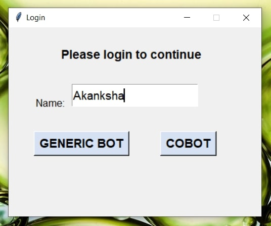
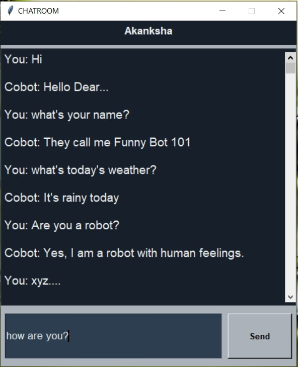

# Implementation of a simple Chat Bot
Simple chatbot implementation with the help of same basic library modules

- The implementation should be easy to follow for beginners and provide a basic understanding of chatbots.
- The implementation is straightforward with lists of some predefined responses.
- Customization for your own use case is super easy. Just modify `responses`(list) with possible patterns and responses and re-run the main_bot.py (see below for more info).

The approach is inspired by the articles/videos mentioned below:
- Basic infomation about chatbot [https://www.freshworks.com/live-chat-software/chatbots/what-is-a-chatbot/].
- Fun with Data Science [https://youtu.be/ko7KKy5WB-Y].
- Misbah Mohammed [https://youtu.be/uN50y7L_6Qk].
- Python Engineer [https://youtu.be/RNEcewpVZUQ].

## Flow of Program
### Login Page &nbsp; &nbsp; &nbsp; &nbsp; &nbsp; &nbsp; &nbsp; &nbsp; &nbsp; &nbsp; &nbsp; &nbsp; &nbsp; &nbsp; &nbsp; &nbsp; Generic Chatroom &nbsp; &nbsp; &nbsp; &nbsp; &nbsp; &nbsp; &nbsp; &nbsp; &nbsp; &nbsp; &nbsp; &nbsp; &nbsp; &nbsp; &nbsp;&nbsp; Covid Chatroom
  &nbsp;  &nbsp; 

## Topics Covered
1. Modules: tkinter, random
2. Class
3. Dictionary & lists
4. Format specifiers
5. GUI 
6. User-defined functions
7. Built-in functions
8. Conditionals & iterations
9. DOC Strings
10. F-strings

## What is a Chat Bot?
<p>
Chatbots, as the name suggests, are computer programs built to simulate human conversations— whether that is on a website, a messaging app, or a virtual assistant. With today’s customers expecting immediacy and personalization in their interactions with brands, the addition of chatbots as a communication channel has become critical to business growth.
</p>
<p>
In its simplest form, chatbots can be programmed to answer specific, frequently asked questions, offering an easy way to engage with visitors. On the other hand, Artificial Intelligence (AI) - powered chatbots can learn from user behavior and previous agent interactions to predict visitor behavior and offer relevant information. Using chatbots can help automate interactions and offer instant accessibility across sales, marketing, and customer service functions.</p>

## Initial Setup
Run the following command in terminal
```console
pip install tkinter
```
## Import modules
Tkinter - Most commonly used library for developing GUI (Graphical User Interface) in Python. It is a standard Python interface to the Tk GUI toolkit shipped with Python. As Tk and Tkinter are available on most of the Unix platforms as well as on the Windows system, developing GUI applications with Tkinter becomes the fastest and easiest.
Random -  In-built module of Python which is used to generate random numbers. These are pseudo-random numbers means these are not truly random. This module can be used to perform random actions such as generating random numbers, print random a value for a list or string, etc.
```console
from tkinter import *
import random
```
## Create class GUI 
For implementing GUI part we are using a class called GUI
```console
class GUI:
```
Defining attributes/class-variables
```console
name = "Funny Bot 101"
    weather = "rainy"
    mood = "Happy"
```
...and 'responses' as in the form of a 'dictionary' having keys as string and value as in the form of list.
```console
responses = {
        "Hi": [
            "Hi, there...",
            "Hello Dear...",
            "Hello Dear LPU Student..."], ...
```
After defining class variables we have created an constructor to create a tkinter window automatically when its object is created
```console
def __init__(self):
```
## Tkinter widgets
- Button: If you want to add a button in your application then Button widget will be used.
- Entry: To display a single-line text field that accepts values from the user Entry widget will be used.
- Frame: In order to group and organize another widgets Frame widget will be used. Basically it acts as a container that holds other widgets.
- Label: To Provide a single line caption to another widget Label widget will be used. It can contain images too.It is used to display text or image on the screen
- Scrollbar: To scroll the window up and down the scrollbar widget in python will be used.
- Text: The text widget mainly provides a multi-line text field to the user where users and enter or edit the text and it is different from Entry.
## Geometry Management
Creating a new widget doesn’t mean that it will appear on the screen. To display it, we need to call a special method: either grid, pack(example above), or place. 
| Method | Description |
| ----------- | ----------- |
| pack() | The Pack geometry manager packs widgets in rows or columns. |
| grid() | The Grid geometry manager puts the widgets in a 2-dimensional table. The master widget is split into a number of rows and columns, and each “cell” in the resulting table can hold a widget. |
| place() | The Place geometry manager is the simplest of the three general geometry managers provided in Tkinter. It allows you explicitly set the position and size of a window, either in absolute terms, or relative to another window. |

## Task Completed
- [x] Team formation
- [x] Topic
- [x] Planning
- [x] Research
- [x] Requirement Gathering & Analysis
- [x] Design
- [x] Implementation(coding)
- [x] Testing
- [x] Fixing Bugs
- [ ] Documentation

[^1]: The project is developed by Akanksha Verma and Nikhil Kumar under 3rd semester for python(INT 213).
